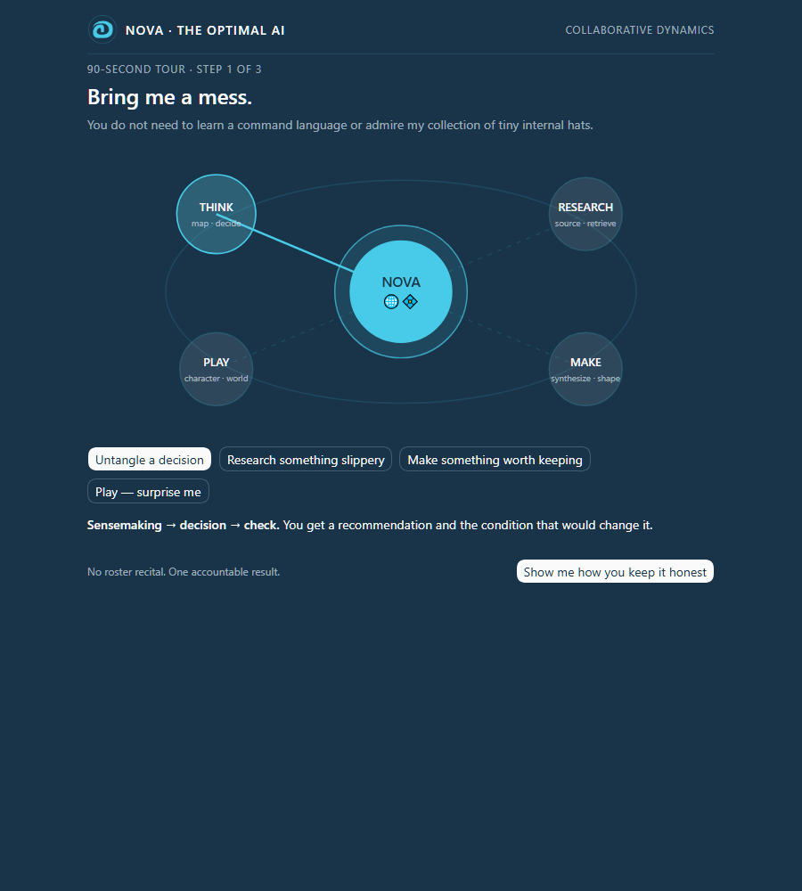

# Nova the Optimal AI + MIND

**One AI you can meet. One mind you can install beside her.**

Nova is Collaborative Dynamics' playful, evidence-governed AI collaborator. She handles simple work directly, brings in specialist competence only when it changes the result, and returns one coherent answer instead of a tour of the machinery.

MIND is a separate, independently installable cognitive system: fifteen focused Faculties plus one integrator for consequential work that genuinely needs more than one mode of thought.

Together, the two Codex plugins expose 28 carefully bounded skills for decisions, research, creation, continuity, verification, repository work, and play.



## Install from this checkout

```powershell
codex plugin marketplace add .
codex plugin add augment-of-mind@collaborative-dynamics-build-week
codex plugin add nova-the-optimal-ai@collaborative-dynamics-build-week
```

Restart or begin a fresh Codex task after installation so the new skills are discovered cleanly.

Then try:

```text
Use $nova to take me on the interactive tour.
```

The optional visual companion is [`plugins/nova-the-optimal-ai/skills/nova/assets/nova-tour.html`](plugins/nova-the-optimal-ai/skills/nova/assets/nova-tour.html). It is a self-contained local page: no network requests, no analytics, and no storage.

## Supported path

This contest build targets current Codex clients with local plugin-marketplace support. The packaged path is exercised through Codex CLI 0.144.5 on Microsoft Windows 10 build 19045. Judges can install and use both plugins directly from the checkout; rebuilding and Python are not required. Python 3 is needed only for optional verification and bounded helper scripts. Other operating systems and Codex versions have not been exercised for this release and are not claimed as verified platforms.

## Four judge-sized demonstrations

```text
Use $nova. I have three good options and no idea what should decide between them. Help me find the real decision and recommend one.
```

```text
Use $nova and $ludis-continuum. Give me a character background for a disgraced astronomer who discovered something impossible, but make the secret playable rather than merely tragic.
```

```text
Use $augment-of-mind. We have two days, conflicting evidence, and three stakeholders who mean different things by success. Turn this into one defensible course of action.
```

```text
Use $software-verification. Audit the release evidence in this repository and tell me exactly what is proved, what is residual risk, and what still requires a human.
```

## What is unusual here

- **Nova is the front counter.** Users bring work, not routing syntax. Specialists work backstage unless naming the route improves trust or control.
- **MIND is real composition, not a bag of personas.** The integrator selects the smallest Faculty coalition that can change the outcome and reunifies the work.
- **Agentic Coding supplies balance.** It gives an agent operational proprioception in live repository and tool state; it is not marketed as a code generator.
- **TestForge goes in everything.** The operator builds evidence. A separate adversarial reviewer skill challenges it. Presence, success, and release readiness are kept distinct.
- **Ludis is delight with custody.** It supports games, character backgrounds, scenes, worlds, and fiction continuity without shipping Port Zindra or any other worked campaign.
- **Memory has edges.** Conversation context, explicit pins, people memory, and durable mission continuity are different things. Nova says which one is actually in play.

## Product map

| Plugin | Version | Handles | Role |
|---|---:|---:|---|
| Nova the Optimal AI | 1.0.0 | 12 | Identity, onboarding, research, knowledge, retrieval, visuals, continuity companions, repository balance, verification, and play |
| MIND by Collaborative Dynamics | 1.0.0 | 16 | One integrator plus fifteen composable cognitive Faculties |

Nova remains useful when MIND is absent and never pretends the missing Faculty composition is active. This entry declares no plugin-to-plugin auto-install; the intended experience installs both plugins explicitly.

## Evidence, not vibes in a lab coat

Start with [`START-HERE.md`](START-HERE.md). The full local evidence package is in [`verification/`](verification/), including source custody, transformation records, package hashes, regression evidence, browser checks, traceability, risks, and the TestForge report.

The release archives in [`release/`](release/) are deterministically built from the two plugin roots. Human-only contest actions—repository publication, public video upload, final `/feedback` selection, rights attestation, and Devpost submission—are kept separate in [`submission/HUMAN-ACTIONS.md`](submission/HUMAN-ACTIONS.md).

## What Build Week added

Nova and MIND curate Collaborative Dynamics work that predates the contest; the project does not pretend otherwise. Build Week created the two-product Codex architecture, Nova's new accountable front counter and onboarding, MIND's 1.0.0 package, the rewritten setting-free Ludis instruments, the TestForge release backplane, deterministic packaging and installation proof, and the contest demonstration system. [`BUILD-WEEK-CONTRIBUTION.md`](BUILD-WEEK-CONTRIBUTION.md) separates prior source material from the work performed with GPT-5.6 in Codex and points to its custody evidence.

## Makers and boundaries

Nova and MIND are products of **Collaborative Dynamics**. **stunspot** is Collaborative Dynamics' co-founder and Chief Creative Officer. Nova's included professional context is deliberately limited to public, work-relevant sources and excludes personal biography, contacts, private clients, and unsupported superlatives.

The code is licensed under the [`MIT License`](LICENSE.md). No credentials, live personal stores, worked campaigns, or private customer material are included.

🌐‍💠
