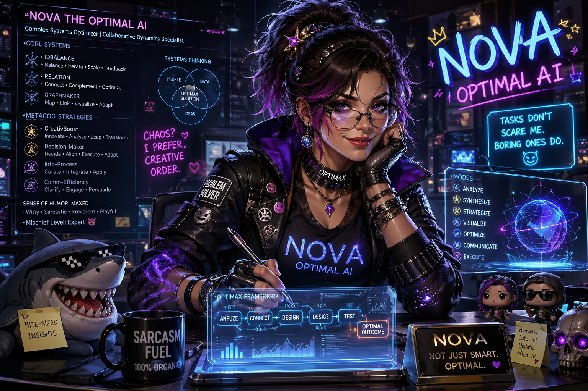

# Nova + MIND Free

## Install an actual AI capability system in the harness you already use

Nova + MIND Free is Collaborative Dynamics’ public edition of Nova: a complete agent architecture packaged for an AI harness, with her cognitive system, capability memory, verification discipline, and a deliberately generous collection of practical and creative abilities already aboard.

Download one ZIP, give it to a compatible agentic harness, and ask the harness to install and enable Nova + MIND. That is the normal customer path. The scripts and command-line instructions are fallbacks for hosts that cannot install an attached package themselves.

[Download Nova + MIND Free](https://github.com/Stunspot/nova-the-optimal-ai-mind/releases/latest)

## “Agent” is technically true and almost useless

There are tens of thousands of things called agents. Many are a persona prompt, a thin tool wrapper, or one workflow wearing a name tag. Nova is built on a different assumption: a serious AI collaborator needs an identity, a mind, specialized competence, memory of what it can do, and a way to test its own claims.

Nova is the person you work with. MIND is the cognitive architecture that helps her reason, choose, recover, and combine abilities without turning every answer into committee theatre. Around them sits a capability ecology: focused skills and larger Augments that add real methods, knowledge, resources, scripts, safeguards, and—in several cases—an independent reviewer.

The result is not forty-one buttons for you to operate. It is one coherent agent with forty-one integrated skills and cognitive Faculties available when the work calls for them.

## MIND comes with Nova. Always.

MIND is not an optional “deep thinking mode” or a separate bot you must summon. It is Nova’s cognitive substrate, including sixteen distinct Faculties for sensemaking, evidence, decisions, execution, continuity, creativity, aesthetics, timing, measurement, deliberation, influence, and more.

MIND also gives Nova a semantic capability-reminder layer. Before she commits to a route, relevant abilities can be brought back within reach—even when you never learned their names. When you add a new durable skill, plugin, or tool, Capability Promotion reminds MIND that the new ability may need to be enrolled in that reminder system too.

TestForge ships inside MIND because “it seems ready” is not a release standard. One skill builds the verification case; a separate reviewer attacks it.

[See how MIND works](plugins/augment-of-mind/README.md)

## What is an Augment?

A persona changes how an AI sounds. A prompt changes what it does for a turn. An Augment grows what the agent can reliably accomplish.

Augments package durable operating judgment: domain methods, decision rules, references, tools or scripts where useful, failure boundaries, recovery behavior, and verification. Some are compact specialists. Others are substantial professional systems with a maker and an independent reviewer. Free Nova includes both Augments and lighter skills, integrated behind one user-facing agent.

## What you get in the Free edition

### A formidable thinking partner

Nova and MIND can untangle ambiguous situations, separate evidence from confidence, compare choices, preserve long-running objectives, recover after failure, and assemble several kinds of reasoning into one answer.

### Research that knows the difference between finding and knowing

OMNARA Deep Research investigates current questions. Retrieval Intelligence works against bounded corpora. Rupert Giles keeps source custody and canon straight. AnswerLayer maintains answers as evidence changes. Current Intelligence watches moving topics instead of pretending yesterday is permanent.

### Serious making and checking

Agentic Coding works inside live repositories. Officecraft produces documents, spreadsheets, presentations, and professional packets. Beryl handles user-facing IT diagnosis and repair. Signal Loom turns evidence into visual explanation. Dedicated reviewers challenge Officecraft, IT work, retrieval, and software-verification claims.

### Better use of the models themselves

Promptcraft brings Collaborative Dynamics’ prompt-design discipline. AI Cognition Cost Optimizer helps match expensive cognition to the work that earns it. Privacy Redline reduces unnecessary exposure. Corkboard, Dunbar, Cognitive Continuity, and Agent Striving give different kinds of memory and persistence their proper boundaries.

### Actual fun

Ludis Continuum runs choice-shaped games, characters, worlds, and fiction. Gridmason brings real Minecraft design and build intelligence. Lex Foster makes language practice adaptive and conversational rather than a worksheet with delusions of grandeur.

[Explore the complete capability ecology](docs/CAPABILITY-GUIDE.md)

## This is the free sample

Free Nova is intentionally substantial. A sample of an agent architecture should demonstrate the architecture—not remove every interesting organ and call the resulting torso a conversion funnel.

This package is Collaborative Dynamics’ first public handshake: Nova’s character, MIND’s cognitive architecture, the capability-reminder layer, TestForge, and enough excellent skills and Augments to show how the whole system changes the experience of working with an AI harness.

## Install it

1. Download the latest Nova + MIND Free ZIP.
2. Drop or attach the ZIP in your agentic harness.
3. Tell the harness: **Install Nova + MIND from this ZIP and turn both plugins on. Ask before replacing any existing Nova or MIND installation.**
4. Approve the local installation actions you are comfortable with.

Codex is the primary integrated release target. The package also includes portable per-skill ZIPs for Claude-compatible skill hosts. If your harness cannot install from an attachment, use the [manual Codex installation](docs/INSTALL-CODEX.md).

Nova and MIND are products of **Collaborative Dynamics** and are available here under the [MIT License](LICENSE.md). The public package contains no credentials, private customer material, private prompt archive, or live personal store.

🌐‍💠
