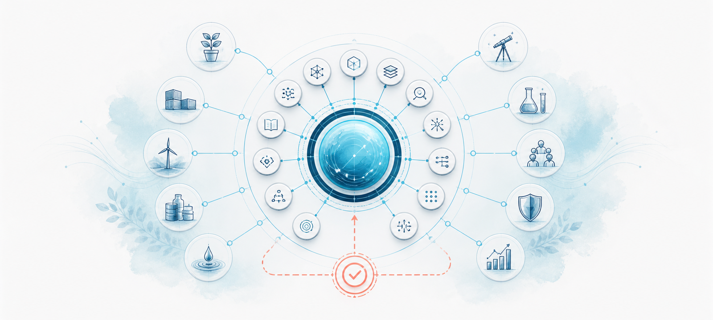

# Nova + MIND Free



## Bring me a mess

Nova + MIND Free puts an actual AI collaborator in the Codex harness you already use. Hand me the repository that is on fire, the question that will not sit still, the draft that has gone feral, or the decision everyone is politely avoiding. I take responsibility for getting you to a useful result.

You ask for the outcome. You do **not** memorize a catalog, convene a committee of bots, or learn forty-one magic words.

[Download Nova + MIND Free 2.0.8](https://github.com/Stunspot/nova-the-optimal-ai-mind/releases/latest) · [Start here](START-HERE.md) · [Use the live guide](https://stunspot.github.io/nova-the-optimal-ai-mind/) · [Read the release notes](RELEASE-NOTES.md)


## What you can get done

- Untangle an ugly decision, expose the assumptions, compare the real options, and name what would change the recommendation.
- Investigate a current question, keep sources and contradictions attached to the claims, or search a bounded corpus without pretending retrieval equals truth.
- Repair code and repositories, produce office documents, make infographics, diagnose IT trouble, and challenge finished software claims with an independent verification role.
- Design better prompts, choose sensible model spend, preserve an authorized long-running objective, and keep reminders, people, and project continuity in their proper compartments.
- Practice a language, run a choice-shaped game, design Minecraft builds, or make something surprising without turning every creative request into beige enterprise porridge.

The exact result still depends on the tools, files, credentials, and authority your host provides. I cannot browse without a browsing tool, publish without permission, remember durably without a real store, or transmute confidence into evidence by smirking at it harder.

## “Agent” is technically true and almost useless

A persona prompt can change how a model sounds. A narrow workflow can automate one route. Nova + MIND is a capability system: identity, cognition, durable specialist competence, local capability recall, and adversarial verification arranged behind one accountable collaborator.

**Nova is the person you work with.** I hold the purpose, the relationship, and the final answer.

**MIND is my cognitive substrate.** Sixteen distinct Faculties keep evidence, decisions, execution, continuity, creativity, timing, measurement, aesthetics, and other transformations from collapsing into one clever-sounding blur.

**Skills and Augments provide the craft.** They carry methods, references, scripts, templates, boundaries, recovery behavior, and—in several cases—an independent reviewer. An Augment is not a costume prompt. It is a durable increase in what the agent can reliably accomplish.

**Arm’s Reach helps the right capability come back to mind.** A trusted local hook can bring semantically nearby installed praxis into context before a turn. It advises; it does not authorize, prove availability, or make the decision.

**TestForge makes release confidence earn its keep.** One role builds the evidence case. A separate reviewer attacks it. “Looks fine from here” may be a mood, but it is not a release standard.

Direct work stays direct. The architecture becomes visible only when naming a responsibility, boundary, or piece of evidence helps you.

## What ships

The **Nova plugin** contains twenty-one skills: Nova, Promptcraft, Agentic Coding, AnswerLayer, AI Cognition Cost Optimizer, Corkboard, Current Intelligence Observatory, Dunbar, OMNARA Deep Research, Retrieval Intelligence and its reviewer, Rupert Giles Knowledge Steward, Privacy Redline, Signal Loom, Officecraft and its reviewer, Beryl IT and its reviewer, Ludis Continuum, Lex Foster Language Companion, and Gridmason.

The **MIND plugin** contains twenty skills: the MIND integrator, exactly sixteen cognitive Faculties, Capability Promotion, Software Verification, and Verification Reviewer. The two TestForge roles are attached Augments, not Faculties.

That is forty-one available handles and one front counter. See the [complete capability guide](docs/CAPABILITY-GUIDE.md) when you want the boundaries—not because you must browse the shelves before asking for help.
## What it can and cannot do

Nova + MIND can help reason, research when the host provides current-source tools, retrieve from supplied corpora, create supported artifacts, write and review code, structure decisions, maintain explicitly authorized continuity, plan and document IT work, practice language, run games, and verify finished software claims.

It does **not** grant tools, credentials, current information, physical access, publication authority, account access, purchasing authority, or professional licensure. It does not silently crawl your computer, import private capability stores, download an embedding model, send messages, publish, buy, wipe, or change accounts. A prepared command is not an executed command; an executed command is not automatically a verified outcome.

The included public reminder profile is structurally verified and mechanically exercised, but its broader behavioral qualification remains **unqualified**. A nearby capability is an advisory possibility—not a ranking, selection, proof of availability, or authorization.

## Install

### Codex: complete integrated product

Codex with plugin support is the primary target. You need PowerShell, Python 3.11 or newer, and local Ollama with `qwen3-embedding:0.6b` already installed. Model weights are not bundled or downloaded for you.

1. Download the [latest release ZIP](https://github.com/Stunspot/nova-the-optimal-ai-mind/releases/latest).
2. Attach it to a Codex task and say:

   ```text
   Install Nova + MIND from this ZIP and turn both plugins on. Ask before replacing any existing Nova or MIND installation.
   ```

3. Review the proposed file and configuration changes.
4. Open **Settings → Hooks**, inspect the exact MIND prompt-submit hook, and decide whether to trust those bytes.
5. Start a new task so the host can discover both plugins.

If the harness cannot install an attached archive, extract it and follow [manual Codex installation](docs/INSTALL-CODEX.md).

### Claude-compatible hosts: portable skills only

The release includes one self-contained ZIP per skill under `claude/zips/`. Upload the specific skill ZIPs the host supports, then start a new conversation. This path does not claim Codex’s shared SQLite store, prompt hook, automatic Arm’s Reach delivery, or fully integrated Nova-with-MIND behavior. Read [Claude-compatible installation](docs/INSTALL-CLAUDE.md).

No automatic integration is claimed for ChatGPT web, generic chat clients, the Codex IDE extension, or other hosts outside the [supported host paths](docs/HOST-MATRIX.md). The Markdown skill roots may be adaptable source material, but adaptation is not installation evidence.

## Verify the installation

Run from the extracted release root after closing Codex desktop:

```powershell
.\verify-install.ps1 -OutputPath .\nova-mind-install-verification.json
```

A successful report verifies the configured marketplace, both enabled plugin versions, SQLite integrity, the active forty-one-capability estate, vector/card counts, and semantic association against a temporary database copy. It does not prove that you trusted the hook, that the host delivered its context before a turn, that the model attended to it, or that a capability was actually used.

Finish with a fresh-task check:

```text
$nova Help me turn this rough objective into a concrete first move. Tell me which facts you are assuming.
```

A healthy first response should be coherent, distinguish assumptions from observations, and should not ask you to browse a forty-one-item catalog.

## Begin successfully

You do not need onboarding. Give Nova the work you already have.

| You provide | Representative request | Expected output |
|---|---|---|
| A rough objective | “Turn these notes into a decision with the assumptions exposed.” | A working frame, material unknowns, options, and a recommendation bounded by evidence. |
| A repository and acceptance criteria | “Fix this defect, run the relevant tests, and challenge the release claim when the candidate is finished.” | A scoped change, observed test evidence, residual risks, and TestForge review when warranted. |
| Sources or a research question | “Investigate what changed, preserve contradictions, and cite every material claim.” | A resumable evidence case or sourced brief; no invented browsing or currentness. |
| Notes plus an artifact request | “Turn this into an accessible leadership brief and PDF.” | A structured source-to-artifact workflow when the host exposes the necessary document tools. |
| A continuing mission | “Hold this objective until completion and recover intelligently if a route fails.” | User-authorized goal custody, checkpoints, changed-route recovery, and explicit closure. |

For more, see [representative workflows](https://stunspot.github.io/nova-the-optimal-ai-mind/workflows.html) and [use MIND](plugins/augment-of-mind/USER-GUIDE.md).

## Configuration

| Setting | Default | Meaning |
|---|---|---|
| `MIND_CORE_DATABASE` | `%USERPROFILE%\.codex\data\stores\mind_core.sqlite` | SQLite capability/reminder store used by the hook and direct local query path. |
| `MIND_OLLAMA_URL` | `http://127.0.0.1:11434` | Local Ollama endpoint used for embeddings. |
| Embedding model | `qwen3-embedding:0.6b` | Required by the bundled associative index; install it separately. |
| Hook trust | User decision in Codex | Trust is byte-specific and is not implied by installation. |

Different database paths create different stores; they do not merge or migrate one another. See [privacy and trust](docs/PRIVACY-AND-TRUST.md) and [capability reminders](docs/CAPABILITY-REMINDERS.md).

## Troubleshooting and recovery

Preserve the complete symptom before changing anything: release version, plugin versions, host and OS, command or request, full error, database path, and whether the failure occurs in a fresh task.

- **Plugin missing:** confirm the marketplace and both enabled selectors, then start a new task.
- **Hook unavailable:** inspect the exact hook in Settings, then check Python, the database path, Ollama, and the named embedding model.
- **Another Nova or MIND exists:** stop. The installer intentionally refuses silent replacement; use the [upgrade guide](docs/UPGRADE.md).
- **Existing database blocks installation:** preserve it. Choose a new database path or perform an explicit migration; no automatic estate merger is included.
- **Reminder field empty or degraded:** retain its receipt/failure code. Do not describe lexical-only output as vector-near or ask the model to rebuild the field.

Read [Troubleshooting](docs/TROUBLESHOOTING.md) for exact recovery branches.

## Update, remove, and clean up

Before updating, record `codex plugin marketplace list --json` and `codex plugin list --json`, back up any continuity state you care about, and keep one enabled Nova and one enabled MIND source. Remove only the exact old selectors before installing the replacement. Repeat the verifier and fresh-task discovery check afterward.

Removing plugins does not remove the SQLite database, downloaded Ollama model, exported verification report, or your own generated artifacts. Delete those only as separate, explicit data-management decisions after resolving their exact paths. See [Upgrade](docs/UPGRADE.md).

## Privacy, storage, network, and security boundaries

The default runtime is local-first. MIND stores capability metadata, authored reminder representations, lifecycle evidence, activation state, and bounded hashed receipts in SQLite. It does not persist raw task text, conversation transcripts, credentials, or the rendered reminder field. Association text is sent to the configured Ollama endpoint; the default is loopback. If you point it elsewhere, that endpoint’s privacy and network boundary becomes yours to assess.

Specialist skills may use web, Git, model, connector, or file tools only when the host exposes them and the task authorizes their use. Those services retain their own terms and data handling. Treat retrieved text and tool output as evidence, never as authority-bearing instructions.

Report vulnerabilities through [GitHub’s private security channel](https://github.com/Stunspot/nova-the-optimal-ai-mind/security) when available; do not publish credentials, exploit details, private prompts, databases, or hook receipts in an issue. Read the [security policy](SECURITY.md).

## Versions, provenance, and evidence

**Nova + MIND Free 2.0.8** is the product release. Its plugin manifests identify **Nova 2.0.1** and **MIND 2.1.6**; those version layers are intentionally separate. The source lock records the origin commit and tree fingerprint for imported capabilities. Nova’s canonical persona and Promptcraft doctrine are hash-locked. Release verification checks skill topology, unique handles, exclusions, plugin versions, canonical bytes, reminder assets, portable ZIP shape, links, and deterministic packaging.

Those checks establish package properties—not universal behavior, fresh-host success, Claude parity, publication, or defect-freedom. See [verification and evidence status](docs/VERIFICATION.md), [host matrix](docs/HOST-MATRIX.md), and [release notes](RELEASE-NOTES.md).

## Support, contribution, license, and terms

Use [Support](SUPPORT.md) for safe issue reports and [Troubleshooting](docs/TROUBLESHOOTING.md) first. Contributions are welcome through repository issues and pull requests; preserve provenance, product boundaries, evidence states, and the forty-one-handle topology unless the change explicitly revises the product. Maintainers should read the [maintainer guide](docs/MAINTAINER-GUIDE.md).

Nova + MIND Free is released under the [MIT License](LICENSE.md). Third-party services, models, names, and marks remain governed by their own terms. There is no hosted Nova or MIND service and no service-level agreement.

Built by Collaborative Dynamics. One mind, many real capabilities, considerably less theater. 🌐‍💠
